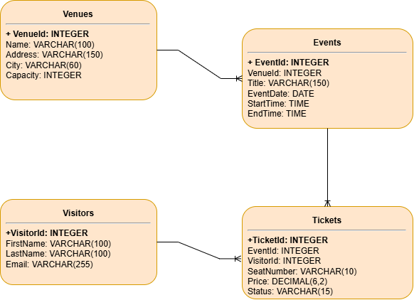

# Homework 2

---

# Part 1: Выбор сценария
Для данной работы был выбран сценарий: **Продажа билетов на мероприятия**. Эта система будет управлять площадками, мероприятиями, посетителями и купленными билетами.

---

# Part 2: Проектирование базы данных и документация

## Идентификация сущностей и атрибутов:

1. Площадки (Venues)
2. Мероприятия (Events)
3. Посетители (Visitors)
4. Билеты (Tickets)

---

## Проектирование таблиц:

---

## 1. Table Name: Venues

**Description:** Хранит информацию о площадках.

**Attributes:**
- **VenueId:** INTEGER, PK, NOT NULL, UNIQUE (AUTO_INCREMENT)
- **Name:** VARCHAR(100), NOT NULL
- **Address:** VARCHAR(150), NOT NULL
- **City:** VARCHAR(60), NOT NULL
- **Capacity:** INT, NOT NULL

**Constraints:**
- `PK_Venues`: PRIMARY KEY (VenueId)
- `UQ_FullAddress`: UNIQUE (Address, City)
- `CHK_Capacity`: CHECK (Capacity > 0)

---

## 2. Table Name: Events

**Description:** Хранит информацию о мероприятиях, проводимых на площадках.

**Attributes:**
- **EventId:** INTEGER, PK, NOT NULL, UNIQUE (AUTO_INCREMENT)
- **VenueId:** INTEGER, FK (REFERENCES Venues), NOT NULL
- **Title:** VARCHAR(150), NOT NULL
- **EventDate:** DATE, NOT NULL
- **StartTime:** TIME, NOT NULL
- **EndTime:** TIME, NOT NULL
- **Status:** ENUM('scheduled', 'cancelled', 'completed'), NOT NULL, DEFAULT 'scheduled'

**Constraints:**
- `PK_Events`: PRIMARY KEY (EventId)
- `FK_Events_Venues`: FOREIGN KEY (VenueId) REFERENCES Venues(VenueId)
- `UQ_VenueSchedule`: UNIQUE (VenueId, EventDate, StartTime)
- `CHK_Times`: CHECK (StartTime < EndTime)

---

## 3. Table Name: Visitors

**Description:** Хранит информацию о посетителях.

**Attributes:**
- **VisitorId:** INTEGER, PK, NOT NULL, UNIQUE (AUTO_INCREMENT)
- **FirstName:** VARCHAR(100), NOT NULL
- **LastName:** VARCHAR(100), NOT NULL
- **Email:** VARCHAR(255), NOT NULL, UNIQUE

**Constraints:**
- `PK_Visitors`: PRIMARY KEY (VisitorId)
- `UQ_Email`: UNIQUE (Email)
- `CHK_Email`: CHECK (Email LIKE '%@%') – проверка, чтобы почта содержала символ @.

---

## 4. Table Name: Tickets

**Description:** Связывающая таблица, реализующая связь «многие-ко-многим» между таблицами Events и Visitors. Записывает информацию о проданных билетах.

**Attributes:**
- **TicketId:** INTEGER, PK, NOT NULL, UNIQUE (AUTO_INCREMENT)
- **EventId:** INTEGER, FK (REFERENCES Events), NOT NULL
- **VisitorId:** INTEGER, FK (REFERENCES Visitors), NOT NULL
- **SeatNumber:** VARCHAR(10), NOT NULL
- **Price:** DECIMAL(10, 2), NOT NULL, CHECK (Price >= 0)
- **Status:** ENUM('booked', 'paid', 'refunded'), NOT NULL, DEFAULT 'booked'

**Constraints:**
- `PK_Tickets`: PRIMARY KEY (TicketId)
- `FK_Tickets_Events`: FOREIGN KEY (EventId) REFERENCES Events(EventId)
- `FK_Tickets_Visitors`: FOREIGN KEY (VisitorId) REFERENCES Visitors(VisitorId)
- `UQ_Tickets_Seat`: UNIQUE (EventId, SeatNumber)

---

## Взаимосвязи:

**1. Venues и Events (Один-ко-Многим)**

Одна площадка может проводить множество мероприятий, но каждое мероприятие проводится на одной площадке.

- `Events.VenueId` является внешним ключом, ссылающимся на `Venues.VenueId`.

---

**2. Events и Tickets (Один-ко-Многим)**

На одно мероприятие может быть продано множество билетов, но каждый билет относится к одному мероприятию.

- `Tickets.EventId` является внешним ключом, ссылающимся на `Events.EventId`.

---

**3. Visitors и Tickets (Один-ко-Многим)**

Один посетитель может приобрести множество билетов, но каждый билет принадлежит одному посетителю.

- `Tickets.VisitorId` является внешним ключом, ссылающимся на `Visitors.VisitorId`.

---

## Part 3: ER-диаграмма

**Рисунок 1 – ER-диаграмма спроектированной базы данных**