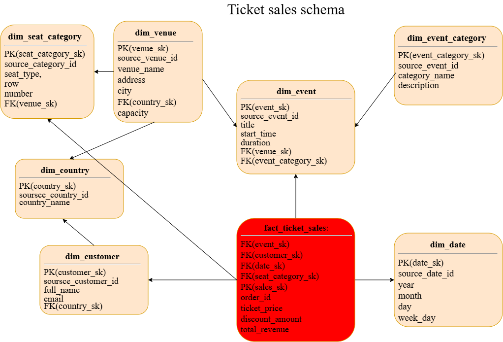

# Creating DWH

## 1. Business area: event ticket sales. 

## 2.1. Business process: ticket sale-purchase (unpredictable, I know). The aim of creating of DWH: revenue analysis, sales dynamics.

## 2.2. Grain: One entry in fact table = one ticket in one order. 

## 2.3. Dimensions:

### • dim_event – "What?"
Attributes: event_sk, sourсe_event_id, title, start_time, duration, FK(venue_sk), FK(event_category_sk)

### • dim_venue – "Where?"
Attributes: venue_sk, sourсe_venue_id, venue_name, address, city, FK(country_sk), capacity

### • dim_customer –"Who?"
Attributes: customer_sk, soursсe_customer_id, full_name, email, FK(country_sk)

### • dim_country–"Where from?"
Attributes: country_sk, soursсe_country_id, country_name

### • dim_date –"When?" – date of purchase (not event)
Attributes: date_sk, sourсe_date_id, year, month, day, week_day

### • dim_seat_category –"What seat type?"
Attributes: seat_category_sk, source_category_id, seat_type, row, number, FK(venue_sk)

### • dim_event_category –"What event type?"
Attributes: event_category_sk, source_event_category_id, category_name, description

## 2.4. Fact table: fact_ticket_sales:

### FK:
- event_sk
- customer_sk
- date_sk
- seat_category_sk 

### PK: 
- sales_sk

### Attributes:
- order_id
- ticket_price
- discount_amount
- total_revenue

## 2.5. see Figure 1 – Ticket sales schema

**Figure 1 – Ticket Sales Schema*

## 2.6. see SQL -script

